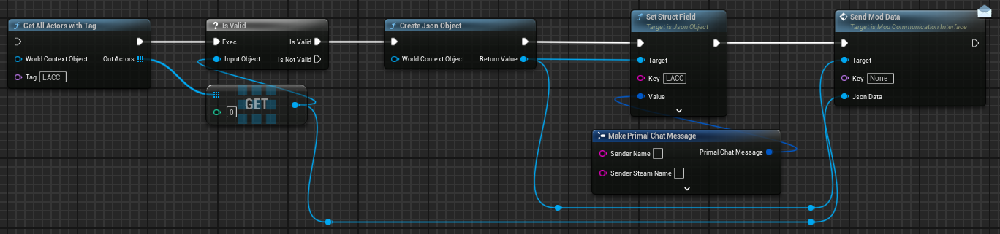
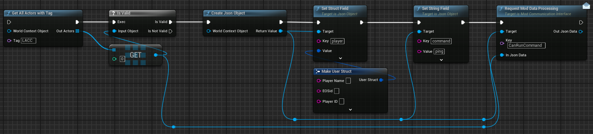
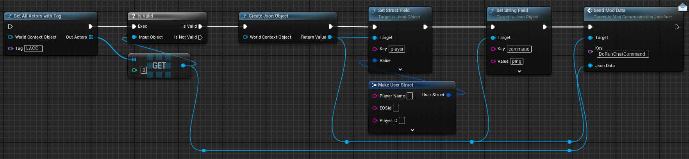
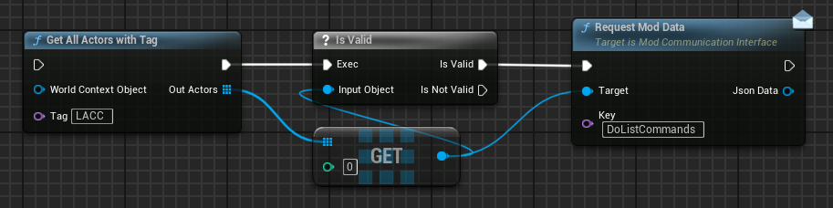
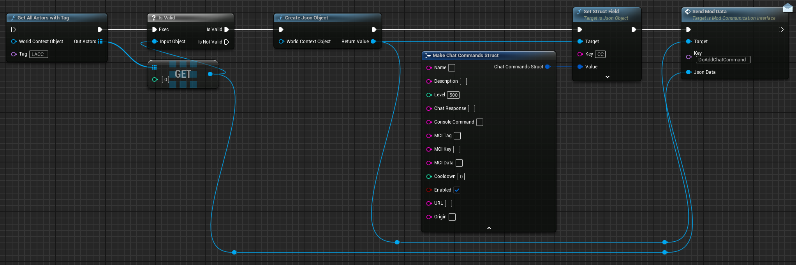
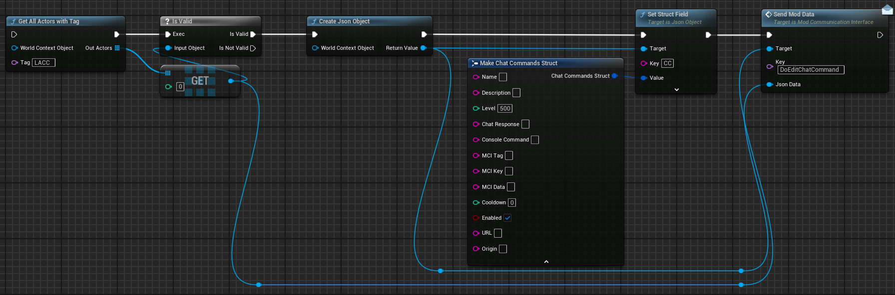
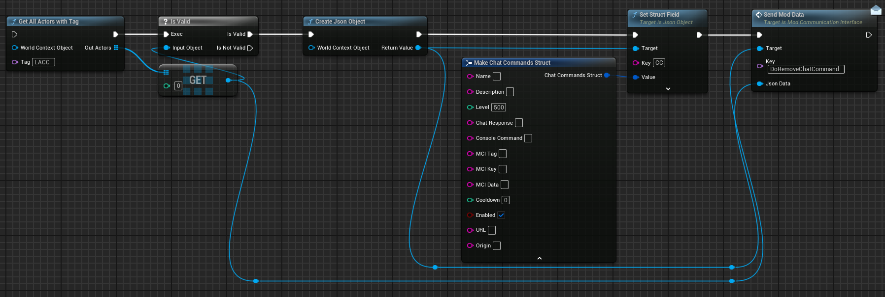

# ModComm Reference

LACC supports Mod intergration via ModComm interface, there a few functions available to modders through this, pass a chat message to the API for relay, add/edit/remove chat commands, check player usage of a command and run a command for a player.

#### Sending a chat message to API

GAAwT -> Create Json -> Set Struct Field with `key` LACC and `value` of primal chat message struct -> SendModData



#### Check a player can run command



##### Request Payload

This is the json to be sent to LACC via the `RequestModDataProcessing` node with the Key of `CanRunCommand`

| Property         | Type     | Description |
|----------------|----------|------------------------------------|
| `PlayerName`   | `String` | The name of a player.              |
| `EOSid`        | `String` | The eosID of a player              |
| `PlayerID`     | `String` | The implant id of a player.        |
| `command`      | `String` | The name of the command to check.  |

??? example "View Request Json"
	```json
	{
		"player": {
			"PlayerName": "Survivor",
			"EOSid": "0320dfg0320df0fgd34",
			"PlayerID": "8409734750"
		},
		"command": "ping"
	}
	```
	Player fields are optional and only requires one to be filled to find a match

##### Return Payload

This is the json sent back from LACC indicating whether the command can be used and a error reason if not

| Property         | Type     | Description |
|----------------|----------|------------------------------------|
| `allowed`      | `bool`   | If the player is allowed to use command, checked against cooldown and level |
| `errorMessage`        | `String` | Reason the command is not allowed              |

??? example "View Return Json"
	```json
	{
		"allowed": true,
		"errorMessage": ""
	}
	```

	```json
	{
		"allowed": false,
		"errorMessage": "Cannot use command: ping for another X seconds / Command: ping is disabled / Commmand not found / Unauthorised to use Command: ping"
	}
	```

#### Run a Command for player



##### Request Payload

This is the json to be sent to LACC via the `SendModData(Message)` node with the Key of `DoRunChatCommand`

| Property         | Type     | Description |
|----------------|----------|------------------------------------|
| `PlayerName`   | `String` | The name of a player.              |
| `EOSid`        | `String` | The eosID of a player              |
| `PlayerID`     | `String` | The implant id of a player.        |
| `command`      | `String` | The name of the command to check.  |

??? example "View Request Json"
	```json
	{
		"player": {
			"PlayerName": "Survivor",
			"EOSid": "0320dfg0320df0fgd34",
			"PlayerID": "8409734750"
		},
		"command": "ping"
	}
	```
	Player fields are optional and only requires one to be filled to find a match

#### Listing all Chat Commands



##### Return Payload

This is the json sent back from LACC with all commands listed with command name as the `key`

| Property       | Type    | Description                                |
| -------------- | ------- | -------------------------------------------|
| Name           | string  | Command name.                      		|
| Description    | string  | Explains the command’s purpose.            |
| Level          | integer | Permission level of command.           	|
| ChatResponse   | string  | Text sent in chat when triggered.  		|
| ConsoleCommand | string  | Console command to execute. 				|
| MCI\_Tag       | string  | MCI tag value (used for GAAwT).            |
| MCI\_Key       | string  | MCI key value (key for SendModData node).  |
| MCI\_Data      | string  | Json string to pass.              			|
| Cooldown       | integer | Time in seconds before reuse (0 = none).   |
| Enabled        | boolean | Whether the command is active.             |
| URL            | string  | External URL for client to open.           |
| origin         | string  | Source of the command definition.  		|


??? example "View Return Json"
	```json
	{
		"ping": {
			"Name": "ping", 
			"Description": "Just replies pong.",
			"Level": 500, 
			"ChatResponse": "pong",
			"ConsoleCommand": "",
			"MCI_Tag": "",
			"MCI_Key": "",
			"MCI_Data": "",
			"Cooldown": 0,
			"Enabled": true,
			"URL": "", 
			"origin": "LACC"
        }
	}
	
	```
#### Adding a Chat Command

This will only add the command if it previously doesnt exist, if a command with the same name from a different origin exist, you command will be prefixed with supplied origin



##### Request Payload

| Property       | Type    | Description                                |
| -------------- | ------- | -------------------------------------------|
| Name           | string  | Command name.                      		|
| Description    | string  | Explains the command’s purpose.            |
| Level          | integer | Permission level of command.           	|
| ChatResponse   | string  | Text sent in chat when triggered.  		|
| ConsoleCommand | string  | Console command to execute. 				|
| MCI\_Tag       | string  | MCI tag value (used for GAAwT).            |
| MCI\_Key       | string  | MCI key value (key for SendModData node).  |
| MCI\_Data      | string  | Json string to pass.              			|
| Cooldown       | integer | Time in seconds before reuse (0 = none).   |
| Enabled        | boolean | Whether the command is active.             |
| URL            | string  | External URL for client to open.           |
| origin         | string  | Source of the command definition.  		|

??? example "View Payload Json"
	```json
	{
		"CC": {
			"Name": "ping", 
			"Description": "Just replies pong.",
			"Level": 500, 
			"ChatResponse": "pong",
			"ConsoleCommand": "",
			"MCI_Tag": "",
			"MCI_Key": "",
			"MCI_Data": "",
			"Cooldown": 0,
			"Enabled": true,
			"URL": "", 
			"origin": "LACC"
        }
	}
	
	```

#### Editing a Chat Command

This will only edit the Command if it previously exists with a matching origin to one supplied, this will handle prefixed commands by itself



##### Request Payload

| Property       | Type    | Description                                |
| -------------- | ------- | -------------------------------------------|
| Name           | string  | Command name.                      		|
| Description    | string  | Explains the command’s purpose.            |
| Level          | integer | Permission level of command.           	|
| ChatResponse   | string  | Text sent in chat when triggered.  		|
| ConsoleCommand | string  | Console command to execute. 				|
| MCI\_Tag       | string  | MCI tag value (used for GAAwT).            |
| MCI\_Key       | string  | MCI key value (key for SendModData node).  |
| MCI\_Data      | string  | Json string to pass.              			|
| Cooldown       | integer | Time in seconds before reuse (0 = none).   |
| Enabled        | boolean | Whether the command is active.             |
| URL            | string  | External URL for client to open.           |
| origin         | string  | Source of the command definition.  		|

??? example "View Payload Json"
	```json
	{
		"CC": {
			"Name": "ping", 
			"Description": "Just replies pong.",
			"Level": 500, 
			"ChatResponse": "pong",
			"ConsoleCommand": "",
			"MCI_Tag": "",
			"MCI_Key": "",
			"MCI_Data": "",
			"Cooldown": 0,
			"Enabled": true,
			"URL": "", 
			"origin": "LACC"
        }
	}
	
	```

#### Removing a Chat Command

This will remove the Chat command with matching name and origin, this will handle prefixed commands by itself



##### Request Payload

| Property       | Type    | Description                                |
| -------------- | ------- | -------------------------------------------|
| Name           | string  | Command name.                      		|
| Description    | string  | Explains the command’s purpose.            |
| Level          | integer | Permission level of command.           	|
| ChatResponse   | string  | Text sent in chat when triggered.  		|
| ConsoleCommand | string  | Console command to execute. 				|
| MCI\_Tag       | string  | MCI tag value (used for GAAwT).            |
| MCI\_Key       | string  | MCI key value (key for SendModData node).  |
| MCI\_Data      | string  | Json string to pass.              			|
| Cooldown       | integer | Time in seconds before reuse (0 = none).   |
| Enabled        | boolean | Whether the command is active.             |
| URL            | string  | External URL for client to open.           |
| origin         | string  | Source of the command definition.  		|

??? example "View Payload Json"
	```json
	{
		"CC": {
			"Name": "ping", 
			"Description": "Just replies pong.",
			"Level": 500, 
			"ChatResponse": "pong",
			"ConsoleCommand": "",
			"MCI_Tag": "",
			"MCI_Key": "",
			"MCI_Data": "",
			"Cooldown": 0,
			"Enabled": true,
			"URL": "", 
			"origin": "LACC"
        }
	}
	
	```