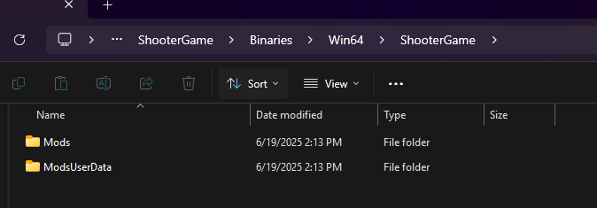

# Troubleshooting

If you are having issues with the mod, the first thing to try is simply restart your game / whole console if on console, especially follwing a update.

Another thing to try is reinstalling a mod.

1. Uninstall mod
2. Restart game / console
	1. If on console you can clear caches at this point
3. Install Mod from ingame menu again
4. Restart again

If on pc and this doesnt work, you can remove the two mod folders below and repeat the above steps. (If you play SinglePlayer make sure to redowload all mods and reactivate ___BEFORE___ loading your SP world again)

And if you're still having issues come visit us in [Discord](https://discord.gg/MR947AvtVJ)